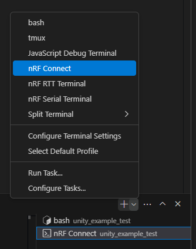

# ncs-unity-example-test

## Prepare

Install nRF Connect SDK and nRF Connect for VS Code.

* ncs: v2.6.1
* toolchain: v2.6.1

Run scripts in "nRF Connect" Terminal.



## Run

```console
$ ./run.sh
...
...
*** Booting nRF Connect SDK v3.5.99-ncs1-1 ***
good!
^C
```

## Test

```console
$ ./test_run.sh
...
...
*** Booting nRF Connect SDK v3.5.99-ncs1-1 ***
tests/example_test.c:20:test_uut_init:PASS
tests/example_test.c:31:test_uut_init_with_param_check:PASS

-----------------------
2 Tests 0 Failures 0 Ignored 
OK
PROJECT EXECUTION SUCCESSFUL
```
